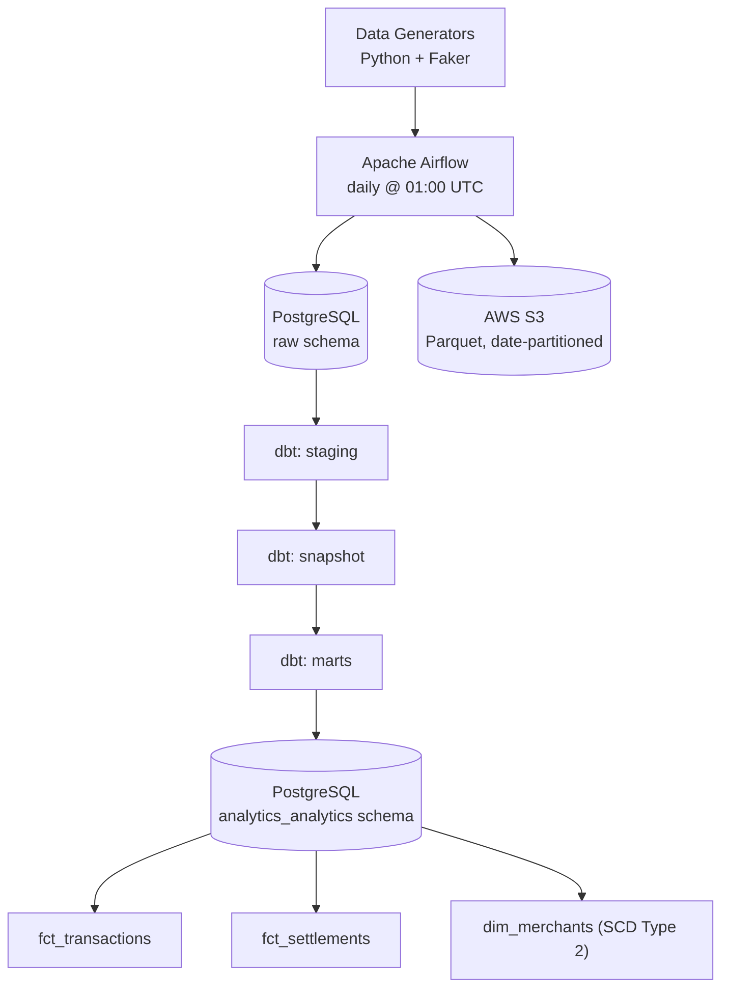
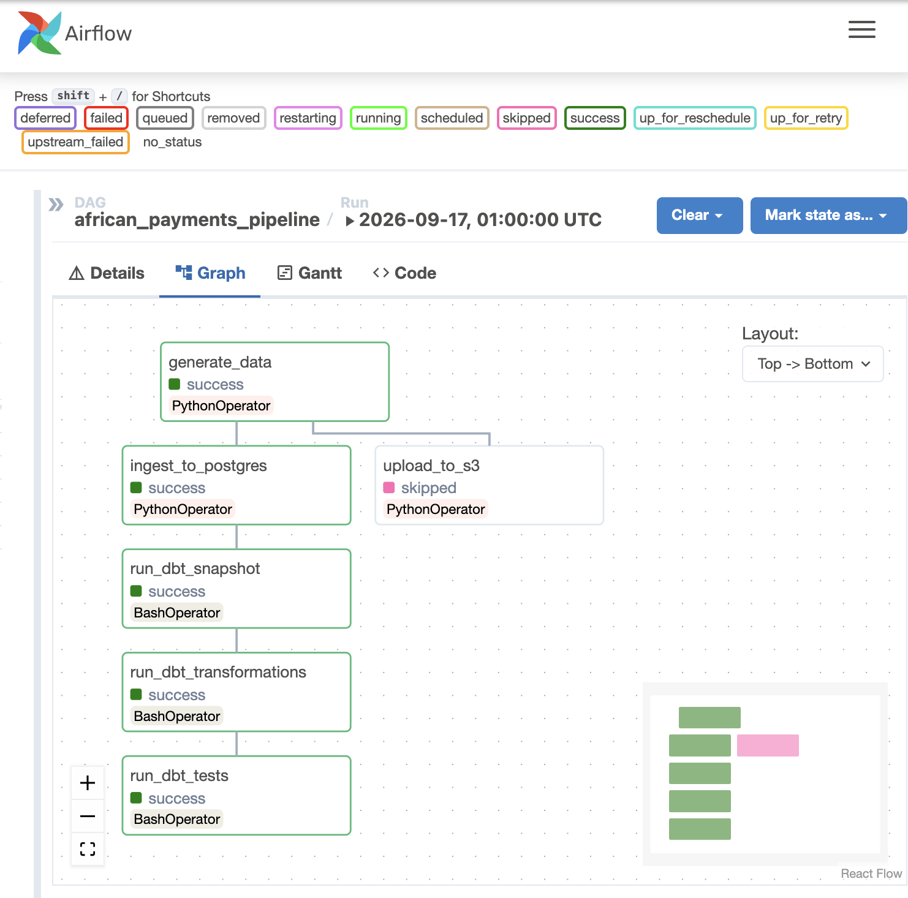

# African Payments & Fintech Data Pipeline

A production-grade batch data pipeline simulating a Paystack/Flutterwave-style payment processing platform. Built to demonstrate end-to-end data engineering across ingestion, transformation, warehousing, and cloud storage.

---

## Architecture





---

## Stack

| Layer | Technology |
|---|---|
| Orchestration | Apache Airflow 2.8 |
| Ingestion | Python, psycopg2 |
| Storage (lake) | AWS S3, Parquet, Snappy |
| Transformation | dbt-postgres 1.7 |
| Warehouse | PostgreSQL 15 |
| Containerisation | Docker, docker-compose |
| Data generation | Python, Faker |

---

## Domain Model

Simulates the core data flows of an African fintech payments processor:

- **Transactions** — payments across card, bank transfer, USSD, mobile money, QR code in NGN/USD/GBP/KES/GHS
- **Merchants** — businesses onboarded by tier (1–3), with Nigerian bank settlement accounts
- **FX Rates** — daily CBN-style exchange rates with realistic drift
- **Chargebacks** — ~2% of successful transactions with open/won/lost resolution
- **Settlements** — weekly merchant settlement batches with fee deductions

---

## Key Engineering Concepts

### SCD Type 2 on dim_merchants
`dim_merchants` is built on a dbt snapshot (`merchants_snapshot`) that watches `raw.merchants` for changes to tier, active status, business type, name, and city using a `check` strategy. When a merchant changes, the snapshot closes out the previous version (`effective_to`) and inserts a new one, with `is_current` flagging the latest — the standard pattern for slowly changing dimensions.

This only produces real history because the daily data generator reuses existing merchant IDs across runs (rather than minting a brand-new, disconnected set of fake merchants every day) and deliberately mutates a small subset — a tier change or an active/inactive flip — each run, giving the snapshot an actual change to detect.

### Date-partitioned S3 storage
All raw data is written as Parquet with Snappy compression under the path:
```
s3://bucket/raw/{table}/year=YYYY/month=MM/day=DD/
```
This enables partition pruning when querying via Athena or Spark.

### dbt lineage
Full DAG from `source(raw)` → `stg_*` → `fct_*` / `dim_*`. All sources have schema tests for uniqueness, nullability, and accepted values.

### Concurrent-run safety
Each DAG run writes its temp data to a unique path (`/tmp/payments_run_data_{run_id}.json`) and passes it to downstream tasks via XCom. This prevents file corruption when multiple DAG runs execute in parallel.

---

## Setup

```bash
git clone https://github.com/yourname/african-payments-pipeline
cd african-payments-pipeline

cp .env.example .env
# Add your AWS credentials to .env

chmod +x scripts/setup.sh
./scripts/setup.sh
```

Airflow UI available at `http://localhost:8080` (admin / admin).

To trigger the pipeline manually:
```bash
docker-compose exec airflow-scheduler \
  airflow dags trigger african_payments_pipeline
```

To run dbt transformations locally:
```bash
cd dbt_project
dbt deps --profiles-dir . --target dev
dbt snapshot --profiles-dir . --target dev
dbt run --profiles-dir . --target dev
dbt test --profiles-dir . --target dev
```

---

## Analytics Output

Key metrics available in the `analytics_analytics` schema after a pipeline run:

| Metric | Query |
|---|---|
| Daily transaction volume (NGN) | `SELECT transaction_date, SUM(amount_ngn) FROM analytics_analytics.fct_transactions WHERE is_successful=1 GROUP BY 1` |
| Chargeback rate by merchant tier | Join `fct_transactions` + `dim_merchants` + `raw.chargebacks` |
| Channel success rates | `SELECT payment_channel, AVG(is_successful) FROM analytics_analytics.fct_transactions GROUP BY 1` |
| Weekly settlement lag | `SELECT merchant_name, AVG(days_to_settle) FROM analytics_analytics.fct_settlements GROUP BY 1` |
| FX exposure by currency | `SELECT currency, SUM(amount) FROM analytics_analytics.fct_transactions WHERE is_successful=1 GROUP BY 1` |
| Fee rate by merchant tier | `SELECT merchant_tier, AVG(fee_rate_pct) FROM analytics_analytics.fct_settlements GROUP BY 1` |

---

## Project Status

- [x] Data generation (merchants, transactions, FX, chargebacks, settlements)
- [x] PostgreSQL raw schema ingestion with upserts
- [x] AWS S3 Parquet upload with date partitioning
- [x] Airflow DAG with retry logic and concurrent-run safety
- [x] dbt staging models + source tests
- [x] dbt mart models (fct_transactions, fct_settlements, dim_merchants SCD Type 2)
- [ ] Grafana dashboard
- [ ] Great Expectations data quality suite
- [ ] MLOps layer — fraud scoring model
